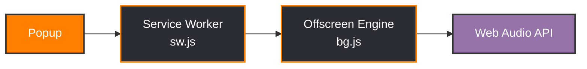
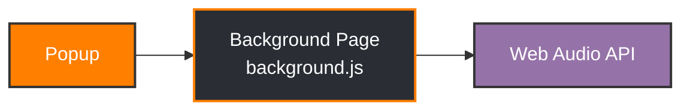

# goatEQ: Gain Optimization & Audio Treatment

> **Get Greatest Of All Time audio quality directly in your browser.** An advanced real-time equalizer and audio enhancement toolkit rebuilt from the ground up for modern browsers.

---

## About this Project

**goatEQ** is a modernized fork of the original "EARS: Bass Boost, EQ Any Audio!" extension. The primary goal of this fork is to fully rewrite and migrate the architecture to **Manifest V3**, ensuring that this beloved audio tool remains fully functional, secure, and compatible with modern versions of Google Chrome and other Chromium-based browsers, while giving it a fresh, responsive UI.

---

## Features

- **11-Band Graphic Equalizer:** Symmetrical parametric control over the entire frequency spectrum.
- **Spectrum Visualizer:** Real-time FFT analysis of whatever tab you're listening to.
- **Preset Library:** Unlimited presets storage. Create, save, and manage custom filter states.
- **Import / Export:** Easily backup your custom presets to a JSON file or share them with others.
- **Deep Bass Boost:** Dedicated low-end harmonic enhancer.
- **Full Privacy Compliance:** Zero external trackers or injected code scripts. Built 100% offline-compliant with Manifest V3.
- **Multi-Browser Support:** Optimized natively for Chrome, Edge, and Firefox.

---

## Architecture (Manifest V3)

Under the hood, **goatEQ** uses a state-of-the-art coordination pipeline that respects the security constraints of Manifest V3 without losing any desktop-audio capabilities.

### Chrome / Edge

- **Service Worker (`sw.js`):** Orchestrator that intercepts active tabs, manages lifetimes, and bridges communication.
- **Offscreen Engine (`bg.js`):** Sandboxed environment that hosts the high-performance Web Audio API, handles user filters, and processes incoming real-time tab streams.

### Firefox

- Firefox uses a persistent **background script** instead of a service worker + offscreen document, running Web Audio directly in the background page.
- No `service_worker`, no `offscreen` API — Firefox does not support these in MV3.

### Safe Guards
Restricts standard browser API bindings using property probes (`'in'` operator) and offline stubs, avoiding runtime TypeError flags in restricted sandbox scopes.

---

## Installation & Sideloading

### Google Chrome & Microsoft Edge
1. Download `goatEQ-v*-chrome.zip` (or `*-edge.zip`) from the **Releases** tab and extract it.
2. Open Chrome/Edge and head to:
   - Chrome: `chrome://extensions/`
   - Edge: `edge://extensions/`
3. Toggle the **Developer mode** switch in the top right.
4. Click **Load unpacked** in the top left.
5. Select the extracted folder.
6. Open your favorite streaming page (e.g. YouTube, Spotify), click the **goatEQ** icon in the toolbar, select **EQ Current Tab** and dial in your sound!

### Mozilla Firefox
1. Download `goatEQ-v*-firefox.xpi` from the **Releases** tab.
2. Open Firefox and navigate to `about:addons`.
3. Click the gear icon next to "Manage Your Extension" and select **Install Add-on From File...**
4. Select the `.xpi` file you downloaded.
5. Enjoy permanent, zero-lag tab equalizing!

---

## Development & Packaging

Each browser has its own source directory with browser-specific manifests and scripts:

- `chromium/` — Chrome build (`sw.js` + `bg.js` + `offscreen.html`)
- `edge/` — Edge build (identical to Chrome)
- `firefox/` — Firefox build (`background.js` with persistent page)

Build with:
```bash
# Build all packages
./chromium/build.sh   # -> dist/goatEQ-v*-chrome.crx
./edge/build.sh       # -> dist/goatEQ-v*-edge.crx
./firefox/build.sh    # -> dist/goatEQ-v*-firefox.xpi
```

For testing in Firefox, load `firefox/test/manifest.json` via `about:debugging#/runtime/this-firefox`.

---

## Contributors

- **Marvin Lee M. (mleem97)** - Lead Developer & Maintainer. Upgraded the toolkit to Manifest V3, stabilized the audio offscreen sandbox, and created the modern *goatEQ* branding.

---

## Sponsoring & Support

If **goatEQ** makes your web audio sound greatest of all time, consider supporting the development!

- **GitHub Sponsors:** [Sponsor @mleem97](https://github.com/sponsors/mleem97)
- **Buy Me A Coffee:** [buymeacoffee.com/mleem97](https://www.buymeacoffee.com/mleem97)
- **Ko-fi:** [ko-fi.com/mleem](https://ko-fi.com/mleem)
- **PayPal:** [paypal.me/mleem97](https://paypal.me/mleem97)
- **Revolut:** [revolut.me/animusfound](https://revolut.me/animusfound)

---

## License

This project is licensed under the MIT License - see the [LICENSE](LICENSE) file for details.
